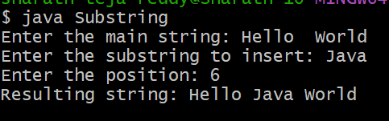
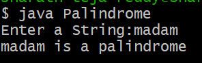
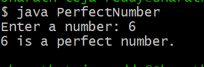

# ADD Exp-1
## Title :Insert a Substring into Mainstring

```java
import java.util.Scanner;

class Substring {
    public static void main(String[] args) {
        Scanner sc = new Scanner(System.in);

        System.out.print("Enter the main string: ");
        String mainString = sc.nextLine();

        System.out.print("Enter the substring to insert: ");
        String subString = sc.nextLine();

        System.out.print("Enter the position: ");
        int position = sc.nextInt();

        if (position >= 0 && position <= mainString.length()) {
            String firstPart = mainString.substring(0, position);
            String secondPart = mainString.substring(position);

            String resultString = firstPart + subString + secondPart;
            System.out.println("Resulting string: " + resultString);
        } else {
            System.out.println("Invalid position");
        }
    }
}
```
# OUTPUT


# ADD EXP-2
## Title :Fibonacci Series
```java
import java.util.Scanner;
class Fibonacci {
    int n;
    int firstNumber;
    int secondNumber;
    int thirdNumber;
    int sum;
    Fibonacci(int number) {
        n = number;
        firstNumber = 0;
        secondNumber = 1;
        thirdNumber = 0;
        sum = 0;
    }
    void generate() {
        System.out.print("Fibonacci Series: ");

        int count = n;
        while (n > 0) {
            sum += firstNumber;

            if (n == 1) {
                System.out.print(firstNumber + ".");
            } else {
                System.out.print(firstNumber + ", ");
            }

            thirdNumber = firstNumber + secondNumber;
            firstNumber = secondNumber;
            secondNumber = thirdNumber;

            n--;
        }

        System.out.println("\nSum of Fibonacci series: " + sum);
    }
    public static void main(String[] args) {
        Scanner sc = new Scanner(System.in);

        System.out.print("Enter the value of n: ");
        int number = sc.nextInt();

        Fibonacci f = new Fibonacci(number);
        f.generate();
    }
}
```
# OUTPUT


# ADD EXP-3
## Title :To determine if a given number is palindrome or not
```java
import java.util.Scanner;

class Palindrome {
    public static void main(String[] args) {
        Scanner sc = new Scanner(System.in);
        System.out.print("Enter a String:");
        String str= sc.nextLine();
        int start = 0;
        int end = str.length() - 1;
        while (start < end) {
            if (str.charAt(start) != str.charAt(end)) {
                System.out.println(str+" is not a palindrome");
                return;
            }

            start++;
            end--;
        }
        System.out.println(str+" is a palindrome");
    }
}
```
# OUTPUT


# ADD EXP-4
## Title :If a given number is Perfect Number or not
```java
import java.util.Scanner;

class PerfectNumber {
    public static void main(String[] args) {
        Scanner sc = new Scanner(System.in);

        System.out.print("Enter a number: ");
        int num = sc.nextInt();

        int sum = 0;

        for (int i = 1; i < num; i++) {
            if (num % i == 0) {
                sum += i;
            }
        }

        if (sum == num)
            System.out.println(num + " is a perfect number.");
        else
            System.out.println(num + " is not a perfect number.");
    }
}
```
# OUTPUT



