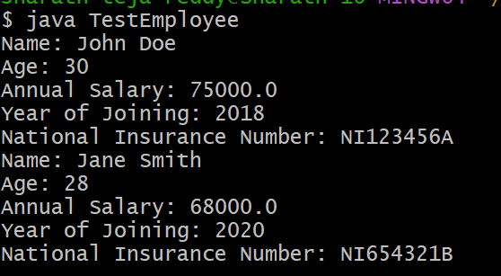
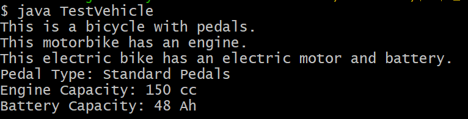
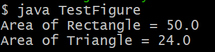

# Exp-4a
## Title : To implement single inheritance
```java
public class Person {
    String name;
    int age;

    public Person(String name, int age) {
        this.name = name;
        this.age = age;
    }

    public void displayPersonDetails() {
        System.out.println("Name: " + name);
        System.out.println("Age: " + age);
    }
}
public class Employee extends Person {
    double annualSalary;
    int yearOfJoining;
    String nationalInsuranceNumber;

    public Employee(String name, int age, double annualSalary, int yearOfJoining, String nationalInsuranceNumber) {
        super(name, age);
        this.annualSalary = annualSalary;
        this.yearOfJoining = yearOfJoining;
        this.nationalInsuranceNumber = nationalInsuranceNumber;
    }

    public void displayEmployeeDetails() {
        displayPersonDetails();
        System.out.println("Annual Salary: " + annualSalary);
        System.out.println("Year of Joining: " + yearOfJoining);
        System.out.println("National Insurance Number: " + nationalInsuranceNumber);
    }
}
public class TestEmployee {
    public static void main(String[] args) {
        Employee emp1 = new Employee("John Doe", 30, 75000.0, 2018, "NI123456A");
        emp1.displayEmployeeDetails();

        Employee emp2 = new Employee("Jane Smith", 28, 68000.0, 2020, "NI654321B");
        emp2.displayEmployeeDetails();
    }
}
```
# OUTPUT


# Exp-4b
## Title : To implement multilevel inheritance
```java
public class Bicycle {
    String pedalType;

    public void showBicycleInfo() {
        System.out.println("This is a bicycle with pedals.");
    }
}
public class Motorbike extends Bicycle {
    int engineCapacity;

    public void showMotorbikeInfo() {
        System.out.println("This motorbike has an engine.");
    }
}
public class ElectricBike extends Motorbike {
    int batteryCapacity;

    public void showElectricBikeInfo() {
        System.out.println("This electric bike has an electric motor and battery.");
    }
}
public class TestVehicle {
    public static void main(String[] args) {
        ElectricBike eBike = new ElectricBike();
        eBike.pedalType = "Standard Pedals";
        eBike.engineCapacity = 150;
        eBike.batteryCapacity = 48;
        eBike.showBicycleInfo();
        eBike.showMotorbikeInfo();
        eBike.showElectricBikeInfo();
        System.out.println("Pedal Type: " + eBike.pedalType);
        System.out.println("Engine Capacity: " + eBike.engineCapacity + " cc");
        System.out.println("Battery Capacity: " + eBike.batteryCapacity + " Ah");
    }
}
```
# OUTPUT


# Exp-4c
## Title : To implement constructor to find area of Different shapes
```java
public abstract class Figure {
    double dim1;
    double dim2;

    public Figure(double dim1, double dim2) {
        this.dim1 = dim1;
        this.dim2 = dim2;
    }

    public abstract double area();
}
public class Rectangle extends Figure {

    public Rectangle(double length, double breadth) {
        super(length, breadth);
    }

    @Override
    public double area() {
        return dim1 * dim2;
    }
}
public class Triangle extends Figure {

    public Triangle(double base, double height) {
        super(base, height);
    }
    public double area() {
        return 0.5 * dim1 * dim2;
    }
}
public class TestFigure {
    public static void main(String[] args) {
        Figure f1 = new Rectangle(10, 5);
        System.out.println("Area of Rectangle = " + f1.area());

        Figure f2 = new Triangle(8, 6);
        System.out.println("Area of Triangle = " + f2.area());
    }
}
```
# OUTPUT

